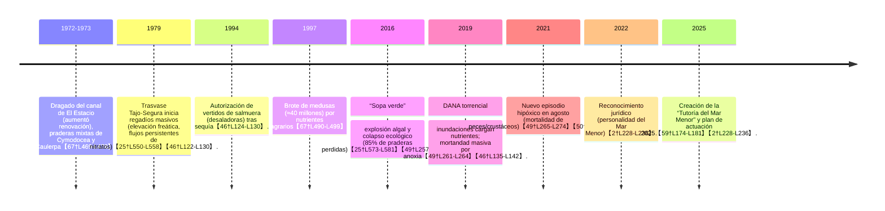

# Resumen Ejecutivo  
El Mar Menor es la mayor laguna salada de Europa (≈135 km²)【18†L68-L75】【35†L199-L204】, un ecosistema semi-cerrado de alta biodiversidad (aves protegidas, peces y plantas endémicas) que hoy enfrenta un colapso ecológico. Desde los años 1980-90, aportes crecientes de nitratos y fósforo —procedentes principalmente de la agricultura intensiva (Campo de Cartagena) y ganadería— han disparado la eutrofización. En 2016 la laguna vivió la “sopa verde” (explosión fitoplanctónica) que eliminó ~85% de sus praderas marinas【25†L573-L581】. Episodios de lluvia intensa (DANA) en 2019 y crisis recurrentes (2016, 2021) han causado mortandad masiva de peces y crustáceos por anoxia en zonas profundas【49†L261-L269】【50†L70-L78】. El conocimiento científico es sólido: la causa primaria son los nutrientes agrícolas (nitratos/fosfatos) que llegan al Mar Menor por escorrentías y drenajes subterráneos (e.g. por la rambla del Albujón)【25†L530-L538】【49†L261-L269】. El agotamiento de vegetación sumergida (fanerógamas) ha alterado las comunidades biológicas (pérdida de hábitats, disminución de peces y mariscos, especies invasoras), con impactos socioeconómicos graves: el turismo y la pesca local sufren y la calidad de vida se deteriora. 

Las administraciones han adoptado múltiples medidas: planes nacionales (MAPMM, 675 M€ hasta 2026【56†L74-L82】) y regionales (Plan Mar Menor 2025, 124 M€) orientados a reducir vertidos (agua residuales, regadíos) y restaurar hábitats【59†L174-L181】【56†L97-L105】. Sin embargo, la efectividad real está en análisis. Existen incubados proyectos innovadores (p.ej. tecnologías de desnitrificación de aguas de la rambla del Albujón【64†L78-L86】【64†L132-L139】), junto con la reconstrucción de dunas, restitución de humedales y reforestación de cuencas. El marco legal incluye la Ley 3/2020 (de recuperación del Mar Menor) y recientes instrumentos (figura del “Consejo del Mar Menor”, personalidad jurídica), pero persisten lagunas: competencias difusas entre Estado, CARM y CHS del Segura, y retrasos en sancionar vertidos ilegales. La monitorización es exhaustiva (programas IEO-CSIC BELICH, boías oceanográficas, imágenes satelitales Copernicus)【22†L195-L204】【39†L628-L637】, aunque falta integración de datos a largo plazo.  

Entre los escenarios futuros destacan: **optimista** (reducción drástica de fertilizantes y vertidos, recuperación progresiva de la claridad y oxigenación, retorno parcial de praderas, enfoque de turismo sostenible); **intermedio** (mejoras lentas, episodios esporádicos de mortandades, adaptación parcial de los usos agrarios); **pesimista** (colapso irreversible con agua similar a aguas residuales e interiorización de eutrofización). Los actores clave (agricultura, turismo, administraciones públicas, ciencia, sociedad civil) siguen enfrentados en diversas controversias sobre responsabilidades y soluciones. Como recomendaciones prioritarias se propone: **(1)** cortar los flujos de nutrientes en origen (reconversión de regadíos, **“depuración verde”** de ríos y del drenaje agrícola, límites estrictos a nitratos)【25†L530-L538】【64†L78-L86】; **(2)** reforzar infraestructuras de saneamiento urbano (los 20 M€ comprometidos recientes)【56†L97-L100】; **(3)** impulsar obras de restauración ecológica (praderas marinas, dunas y humedales costeros) con planes a medio plazo; **(4)** mantener un monitoreo científico riguroso y público (ej. boías y satélite)【22†L195-L204】【39†L628-L637】; y **(5)** asegurar una gobernanza coordinada y transparente (definir claramente roles de CHS, CARM, Estado) y un régimen sancionador real. No hay solución única: se requieren acciones simultáneas en toda la cuenca. Se debe insistir en medidas técnicas “comprobadas” (p.ej. tecnologías de desnitrificación en la Rambla del Albujón【64†L78-L86】【64†L132-L139】) y mantener la presión social y legal. Dado que los datos precisos (costes exactos, tasas de recuperación) aún son inciertos, se recomienda establecer objetivos por fases (p. ej. reducción del 50% de nitratos en 5 años) e indicadores claros (calidad de agua, cobertura vegetal) para evaluar el progreso.  

## Ubicación y geografía  
【36†embed_image】El Mar Menor es una laguna litoral de la costa mediterránea de Murcia (España), separada del mar abierto por el istmo de La Manga (ver imagen satelital)【18†L68-L75】【35†L199-L204】. Tiene ~135 km² de superficie y una profundidad media de ~4 m (máx. 7 m)【12†L436-L444】. Geológicamente es una bahía parcialmente cerrada formada en el Cuaternario por la sedimentación costera y cinco golas (canales) que conectan con el Mediterráneo: El Estacio, Marchamalo y tres golas al norte (“Encañizadas”)【12†L448-L457】. Estos estrechos regulan la renovación de agua (período renovac. ≈2 años)【12†L448-L457】. Las cinco islas volcánicas (Sujeto, Perdiguera, Redonda, Ciervo, Barón) protegen su interior de oleaje. A su alrededor hay salinas históricas (San Pedro y Marchamalo) y un paisaje de huerta intensiva. El intercambio limitado con el Mediterráneo hace al Mar Menor especialmente sensible: los aportes externos de agua dulce (ríos y lluvias) y salada (golfa) definen fuertemente su hidrología y química.

## Hidrología y química del agua  
El balance hídrico del Mar Menor resulta de tres fuentes principales: escorrentía continental (ríos temporales, drenajes agrícolas), precipitación directa y flujo marino a través de las golas. La laguna tiene habitualmente una salinidad **hipersalina** (>42 PSU), superior al mar exterior (≈38 PSU), debido a su evaporación intensa【25†L530-L538】. Existe variación estacional: en verano la evaporación concentraba sales y aumentaba la salinidad, mientras que lluvias intensas (e.g. Dana 2019) la reducen bruscamente. Estudios recientes indican que los picos de precipitación invernales correlacionan con descensos agudos de salinidad en superficie (hasta ≈37) cuando entra agua dulce por El Estacio y Marchamalo【40†L42-L46】. Sin embargo, en ausencia de lluvias extremas el Mar Menor suele estar relativamente bien mezclado: por ejemplo, en 2022 –a pesar de fuertes lluvias en marzo– no se observó estratificación termohalina permanente【9†L141-L148】. Así, gran parte del año el ecosistema es polimíctico, pero puede presentar capas estratificadas cortas en condiciones excepcionales (lluvia masiva seguida de calma).

La química del agua refleja **eutrofización crónica**. Los niveles de nutrientes (nitrógeno y fósforo) han crecido significativamente en décadas: los nitratos en la laguna pasaron de ~0,06 mg/L en los 80 a ~0,37 mg/L en 2017【25†L599-L603】. La razón DIN:SRP (nitrógeno inorgánico disuelto vs fosfato) supera ampliamente el ratio Redfield, indicando predominio de nitrógeno disponible. En aguas mediterráneas de la cuenca (Campo de Cartagena) se documentan concentraciones de nitratos en el acuífero ≈200–250 mg/L【20†L408-L412】. La coexistencia de nitratos elevados con fitoplancton abundante hace que el fósforo sea a menudo el nutriente limitante; no obstante, ambos nutrientes entran en exceso al Mar Menor por escorrentías y desnitrificaciones insuficientes【25†L530-L538】【20†L404-L412】. El oxígeno disuelto en superficie suele ser adecuado, pero por debajo de ~4–6 m puede formarse una “bolsa” anóxica en verano. P. ej., un informe reciente muestra en primavera de 2022 valores de potencial redox positivos (>+70 mV) incluso en fondo, indicando buena oxigenación general【9†L127-L136】. No obstante, cada año de estío el riesgo de hipoxia subsuperficial es alto; la descomposición de materia orgánica tras blooms masivos en 2016, 2019 y 2021 agotó el oxígeno disuelto, causando mortandades en zona profunda【49†L261-L269】【50†L70-L78】.

## Biodiversidad (especies clave y conservación)  
El Mar Menor alberga una biodiversidad singular: comunidades marinas y costeras únicas en la región. Entre plantas sumergidas (fanerógamas) destacan la **Cymodocea nodosa** y la macroalga **Caulerpa prolifera**, que históricamente formaron extensas praderas bentónicas【67†L469-L478】【12†L480-L487】. Hasta los años 1990 estas especies cubrían la mayor parte del fondo. Sin embargo, tras 2016 solo quedan parches muy reducidos (≈15%) de vegetación sumergida, concentrados en la franja más superficial【25†L573-L581】. Estas praderas cumplen funciones clave (hábitat, oxígeno, fijación de sedimentos) y su pérdida ha alterado el ecosistema.

En cuanto a fauna marina, destacan especies emblemáticas protegidas: el pez **fartet** (*Aphanius iberus*) es endémico ibérico y está gravemente amenazado, la **nacra** (*Pinna nobilis*) de gran tamaño ha sufrido mortalidades masivas en la región, y el **caballito de mar** del Mediterráneo (*Hippocampus guttulatus*) está en peligro crítico en la laguna【18†L104-L110】. En aves, la zona húmeda atrae numerosas aves acuáticas migratorias y marinas; destaca la **gaviota de Audouin** (*Larus audouinii*) y el **charrancito común** (*Sternula albifrons*), ambos protegidos【18†L97-L105】. En las orillas viven plantas halófilas y endemismos como **Caralluma europaea** o **Echinophora spinosa**【18†L99-L107】. Otros vertebrados asociados incluyen tortugas marinas (como *Caretta caretta* en paso a paso) y distintos invertebrados bentónicos adaptados a alta salinidad.

El estado de conservación de estas especies es crítico. Muchas están en listas roja/regional: *A. iberus* y *H. guttulatus* se consideran en peligro crítico, *P. nobilis* en peligro, y la *Cymodocea* figura en catálogos de protección marina. Las Zonas de Especial Conservación y ZEPA que protegen el Mar Menor contemplan hábitats de praderas marinas y saladares costeros de interés comunitario【18†L78-L87】. Sin embargo, la calidad del hábitat se ha degradado tanto que hoy varias poblaciones se colapsan o desaparecen. Por ejemplo, la explosión de fitoplancton y anoxia de 2016 acabó con el 85% de la vegetación bentónica【25†L573-L581】, lo que redujo refugio y alimento de muchas especies bentónicas (peces, crustáceos, moluscos) e incrementó la entrada de especies oportunistas (algas filamentosas). Las mortandades de peces han sido tan alarmantes que comunidades locales las perciben como una pérdida de un recurso natural (p. ej. en 2021 se recogieron ~4,5 toneladas de peces muertos en las playas, más que las 3 t de 2019)【50†L70-L78】. 

## Historia ambiental y cronología de la crisis  
- **1970s:** aguas limpas, praderas oligotróficas. Hasta 1970 eran cristalinas y oligotróficas con vegetación abundante (*Cymodocea nodosa*) en todo el fondo【67†L469-L478】.  
- **1972–73:** **dragado del canal de El Estacio.** Se ensancha el Estacio, aumentando la renovación con el Mediterráneo【67†L469-L478】. Como consecuencia bajó la salinidad y las temperaturas extremas, permitiendo que especies más “invasoras” (p.ej. *Caulerpa prolifera*) se establecieran en el Mar Menor【67†L469-L478】. A inicios de los 80 surgió una pradera mixta de *Cymodocea* y *Caulerpa* en casi todo el fondo【67†L469-L478】.  
- **1979:** **Trasvase Tajo-Segura.** A partir de 1979 se aporta agua dulce a la cuenca, lo que impulsó la expansión del regadío en el Campo de Cartagena. Esto elevó el nivel freático del acuífero y transformó la rambla del Albujón en cauce permanente con drenajes ricos en nitratos【25†L550-L558】【46†L122-L130】.  
- **1980–1990:** **expansión del regadío y cultivo intensivo.** El aumento de abonos nitrogenados fertiliza los suelos; en los 90 la pradera de *Caulerpa* cubría la mayor parte del fondo【67†L481-L489】. Además, en 1994 la CH Segura autorizó el vertido de salmuera de desaladoras al litoral para paliar la sequía【46†L124-L130】, incrementando otro tipo de vertidos.  
- **1990s:** **brotes de eutrofización leve:** comenzaron a aparecer indicios de blooms en verano vinculados a lluvias y escorrentías agrícolas. Un caso notable fue la masiva proliferación de medusas ctenóforas (*Pelagia noctiluca*) a mediados de los 90: para el verano de 1997 se estimaron ≈40 millones de individuos en la laguna, debido a nutrientes agrarios【67†L490-L499】.  
- **2015–2016:** **colapso ecológico (“sopa verde”).** El proceso de eutrofización llegó a un punto crítico. En otoño de 2015 y primavera 2016 se produjo una explosión fitoplanctónica sin precedentes: el agua se volvió verde y turbia. En septiembre/octubre 2016 el IEO documentó que el 85% de las praderas submarinas habían muerto【25†L573-L581】. Este evento, denominado “sopa verde”, certificó el colapso ambiental de la laguna【25†L573-L581】【46†L135-L142】. A la vez murieron bentos marinos, desaparecieron praderas y se desató anoxia en el fondo.  
- **2019:** **DANA (“gota fría”) mortal.** En octubre 2019, una Depresión Aislada en Niveles Altos (DANA) arrastró torrentes de agua dulce con elevados cargamentos de tierra y nutrientes (especialmente nitratos) hacia la laguna【46†L135-L142】. Esto provocó rápidamente un episodio de anoxia en zonas profundas: playas enteras se convirtieron en “cementerios” de peces y crustáceos. Las autoridades recogieron toneladas de fauna muerta en días【46†L135-L142】【49†L261-L264】. Este desastre fue atribuible a la suma del ya crítico estado interno del ecosistema y el aporte masivo de agua eutrófica superficial.  
- **2021:** **nueva mortandad masiva.** En agosto de 2021 se detectó otro episodio agudo de falta de oxígeno (hipoxia) en la parte sur de la laguna, vinculada de nuevo a un afloramiento de fitoplancton tras aporte de nutrientes【49†L265-L274】【50†L70-L78】. En ocho días el Gobierno regional recogió ~4,5 t de peces muertos en playas (de nuevo praderas destruidas y bolsas anóxicas), superando el registro de 2019【50†L70-L78】.  
- **2022:** **nuevas políticas y derechos.** La intensa movilización ciudadana culminó con la aprobación de la Ley de la Laguna (Ley 3/2020), y en 2022 la laguna obtuvo **personalidad jurídica propia**【2†L228-L236】. Este “derecho de la laguna” implicó nombrar un “tutor” legal para su protección.  
- **2025:** **Tutoría del Mar Menor.** En 2025 se constituyó la figura de la *“Tutoría del Mar Menor”*, órgano con representantes públicos, privados y expertos, para supervisar medidas de recuperación【2†L228-L236】. Asimismo se aprobó el Plan Mar Menor 2025, con 207 proyectos (≈124,7 M€) medioambientales y socioeconómicos【59†L174-L181】.

## Causas y fuentes de contaminación  
La evidencia científica señala **sin ambigüedad** las principales fuentes de contaminación del Mar Menor: *fertilizantes y estiércoles agrícolas*. La agricultura intensiva en la cuenca (especialmente en el Campo de Cartagena) aporta anualmente miles de toneladas de nitrógeno y fósforo al sistema. Por ejemplo, el IGME estimó que durante 2014–2016 entraban al Mar Menor unas **3.300 t nitrato/año** sólo por la rambla del Albujón【25†L528-L534】. En la región hay ≈400 granjas porcinas (800.000 cerdos) que generan ~5.700 tN/año【20†L414-L422】; este nitrógeno no siempre se aprovecha en el campo y corre al acuífero, incrementando los retornos. En total, el superávit de nitrógeno aplicado se calcula en 160–180 kgN/ha en la cuenca【20†L404-L412】【20†L414-L422】. Estos nutrientes se filtran al Mar Menor tanto por ríos temporales (Rambla del Albujón, Tordera, etc.) como por drenaje subterráneo continuo (nivel freático elevado).  

Otras fuentes secundarias contribuyen: aguas residuales urbanas maltratadas (zonas sin depuradoras o con fugas) aportan nitrógeno y fósforo. En estudios recientes se destaca también el aporte de **agua desalada**: desde 1994 las desaladoras vertieron al mar su salmuera y lodos, cargados de sal y nitratos, incluso después de superarse la sequía【46†L124-L130】. Además, actividades mineras históricas en la sierra colindante introducen metales y sólidos finos a traves de ramblas (se prevé remediarlos en planes actuales【56†L129-L137】). La urbanización costera (La Manga y poblaciones litorales) incrementa impermeabilización y escorrentía tóxica (aceites, plásticos), y el turismo intensivo puede generar contaminación por asimilación insuficiente en veraneos masivos.  

El consenso es que **los vertidos agrarios son el catalizador principal**. Según el Comité Científico del Mar Menor (2017) y documentación oficial, la crisis de eutrofización fue causada “fundamentalmente por los aportes de nitratos en las escorrentías ordinarias y flujos subterráneos del Campo de Cartagena”【25†L530-L538】. Cada lluvia suele arrastrar fertilizantes nitrogenados de olivares y hortícolas: se ha verificado que la lixiviación de abonos sumada al drenaje intensivo del regadío ha convertido al Mar Menor en un receptáculo de aguas cargadas de nitratos de origen agrícola【25†L530-L538】. Estas entradas agrícolas se han combinado con eventos puntuales (DANA, grandes tormentas) que, al momento de máxima carga, originan blooms tóxicos y mortandad. En suma, la contaminación actual es mayoritariamente **no puntual** y crónica: es el flujo constante de nutrientes de fondo el que ha matado el ecosistema.

## Impactos ecológicos y socioeconómicos  
La degradación del Mar Menor tiene repercusiones ambientales severas y costos sociales/económicos elevados. **Ecológicamente**, la eutrofización y anoxia han provocado: (i) muerte masiva de praderas sumergidas (alterando los hábitats bentónicos)【25†L573-L581】; (ii) desaparición parcial de bancos de ostras, moluscos y algas (p.ej. nacra) por falta de oxígeno; (iii) colapso de comunidades de peces y crustáceos bentónicos (que usaban las praderas como refugio y alimento)【25†L593-L601】; (iv) proliferación de algas filamentosas (por falta de competidores) y medusas (por menor depredación) en episodios posteriores【12†L402-L411】【67†L490-L499】; (v) incertidumbre sobre la recuperación natural de los hábitats (muchas praderas no rebrotan sola). Globalmente, el Mar Menor ha pasado de un estado oligotrófico (baja productividad) a altamente eutrófico en 2-3 décadas【12†L428-L434】【25†L599-L603】.   

En términos **socioeconómicos**, el impacto también es notable: la costa del Mar Menor es un motor turístico (alrededor del 50% de la oferta hotelera regional se ubica en La Manga y alrededores【2†L68-L75】). Las crisis ambientales disminuyen la atracción turística: estudios constatan que, con niveles altos de contaminación, **los turistas abandonan la laguna en favor de otros destinos**【51†L148-L156】. También deprime el mercado inmobiliario local: entre 2015-2021 las viviendas en el entorno del Mar Menor se revalorizaron ~45% menos que en zonas costeras vecinas (pérdida estimada de ~4.150 M€ de valor de mercado)【51†L175-L181】. En pesca, aunque la actividad extractiva es menor que antes, las mortandades masivas reducen el poco stock remanente de especies litorales (p. ej. lubinas, doradas pequeñas, crustáceos). Las comunidades locales (pescadores y acuicultores) denuncian declives en capturas y la necesidad de vedas prolongadas. La salud pública ha recibido atención (p.ej. lodos termales en La Puntica con demanda terapéutica), pero el deterioro paisajístico y la aparición de olores y desechos en playas afectadas son un riesgo sanitario y de imagen. Las muertes de peces en playa también suponen gasto directo en limpieza por parte de los ayuntamientos, y generan preocupación ciudadana.  

Además, el Mar Menor tiene un **valor cultural y social**: forma parte de la identidad murciana. Su degradación ha llevado a conflictos sociales – manifestaciones “SOS Mar Menor”, tensiones políticas y litis diplomáticos entre administraciones – y a cambios jurídicos inéditos (personalidad jurídica). En conjunto, se está perdiendo un patrimonio natural de interés científico y recreativo, con consecuencias de largo plazo para la economía costera.

## Medidas de gestión y restauración (planes y proyectos)  
Las administraciones han lanzado planes multianuales para detener el deterioro: el **Plan de Actuación del Mar Menor 2025** (Murcia) y el **Marco de Actuaciones Prioritarias (MAPMM)** del MITECO (estatal). El plan regional (207 acciones, 124,7 M€ totales: 97,5 M€ ambientales y 27,2 M€ socioeconómicos) identifica proyectos de saneamiento, restauración de ecosistemas, investigación e impulso económico local【59†L174-L181】. El MAPMM estatal, dotado con 675 M€ hasta 2026, ha dedicado ya 226,6 M€ (33%) y ejecutado 110,1 M€ (16%) en proyectos prioritarios (4T2025)【56†L74-L82】. Destacan inversiones en: (i) **tratamiento de purines y subvención a ganadería extensiva** (convocatorias de hasta 11,5 M€)【56†L90-L98】; (ii) **infraestructura hidráulica** (bombas de bombeo en Albujón, estanques de laminación, obras anti-inundaciones) por decenas de M€【56†L101-L109】; (iii) **mejora del saneamiento municipal** (20 M€ para redes separativas y EDAR de municipios vertientes)【56†L97-L100】; (iv) **restauración de ramblas mineras y zonas periurbanas** (proyectos por ~17,5 M€ para limpiar cauces y reforestar)【56†L121-L124】; (v) **regeneración de ecosistemas litorales** (fases de restauración de dunas en La Manga, inventarios de hábitats)【56†L84-L90】; y (vi) **monitoreo ambiental y proyectos LIFE/CETTI**. 

Adicionalmente se han puesto en marcha iniciativas públicas-privadas innovadoras: el **programa “Recupera” (Murcia)** convoca empresas para desarrollar prototipos de tratamientos de desnitrificación del agua (Compra Pública de Innovación, 5 M€ movilizados: 1,25 M€ CARM + 3 M€ FEDER + 0,75 M€ CDTI)【64†L78-L86】【64†L132-L139】. Estos proyectos piloto se localizan en la rambla del Albujón (principal cuello de botella) y buscan tecnologías aplicables en origen para cortar el flujo de nitratos. 

En 2019–2024 se han introducido programas de **reducción de fertilización** y asesoría a agricultores, pero su impacto concreto es difícil de medir. La CH Segura ha impulsado la desconexión de riegos ilegales: ya se han precintado 9.179 ha en áreas sin derechos de agua y gestionado 173 expedientes por vertidos no autorizados【56†L111-L119】, lo que impide la entrada de gran parte de los sobrantes de nitrógeno. A nivel de restauración ecológica se avanzó poco hasta 2025, pero está en marcha la creación de un “cinturón verde” periurbano (complejo Carmolí-La Azohía) para filtrar sedimentos y recuperar dunas; el hito es la aprobación de la fase I de restauración de la Sierra Minera (8 M€ adicionales de 2025)【56†L129-L137】. 

En resumen, las acciones propuestas combinan **prevención** (control de usos agrarios, depuración) con **remediación** (recreación de hábitats, ingeniería fluvial). Sin embargo, la eficacia y ejecución completa aún están por evaluarse. El retraso en aprobar o ejecutar muchas medidas (de 2020 a 2023) se ha criticado. Aun así, los primeros informes señalan avances: por ejemplo, la restauración de dunas de La Manga (fase I, 210.000 €) y ayudas agrarias indican un compromiso creciente【56†L84-L93】. El reto es coordinar todas estas intervenciones y sostenerlas en el tiempo.

**Tabla comparativa (medidas vs coste/eficacia):**

| Medida                                         | Costo estimado (aprox.)       | Efectividad prevista            | Comentarios                                    |
|-----------------------------------------------|-----------------------------|--------------------------------|------------------------------------------------|
| Reconversión de regadíos (fertilizantes ↓)     | Alto (decenas a cientos M€) | Muy alta (reduce nitratos “de raíz”) | Requiere ayudas/EU y regulación estricta.      |
| Depuración y saneamiento municipal             | ~20 M€ (ya comprometidos)   | Alta (Quita >80% nutrientes urbanos) | 2000+ Eden previas deficiencias.               |
| Filtros verdes e humedales artificiales        | Varios M€ (Proyecto LIFE)   | Media-alta (retiene nitratos/fósforo) | En fase experimental/piloto.                  |
| Bombas de drenaje Albujón (Bombeo Albujón)     | Bajo (instalaciones existentes) | Media (retira un % de caudal cargado)  | Actualmente bombea ~1,8 hm³/año para riego.    |
| Estaciones de desnitrificación (tecnología)    | 5 M€ (Recupera)            | Pendiente (proyectos en prueba) | Tecnologías piloto; su éxito es clave.        |
| Restauración de hábitats (praderas/dunas)      | Alto (20–50 M€ según escala)| Alta (recupera biodiversidad)  | Necesita repoblar plantas marinas; cultivos in situ. |
| Control de vertidos y sanciones                | Variable (administrativo)  | Alta (disuade incumplimientos) | Depende de vigilancia; + de 173 expedientes abiertos【56†L111-L119】. |
| Educación y concienciación                    | Bajo (campañas info)       | Baja-med (refuerzo social)     | Importante, pero insuficiente sin acción técnica. |

## Marco legal y responsabilidades administrativas  
El marco jurídico está encabezado por la **Ley 3/2020, de 27 de julio, de recuperación y protección del Mar Menor**, aprobada tras la crisis de 2019. Esta ley reconoce el Mar Menor como espacio singular, crea el Consejo del Mar Menor (órgano consultivo interadministrativo) y obliga a planes y estudios específicos para reducir nutrientes y restaurar la laguna【46†L69-L75】【60†L1-L4】. Sin embargo, carece de régimen sancionador propio fuerte (existen dos: uno en la ley y otro regulado en aguas) que hasta ahora ha fallado en disuadir a las principales fuentes de contaminación. En 2022 se dio un paso jurídico inédito al conceder **personalidad jurídica** a la laguna (por iniciativa popular), lo que legalmente fortalece su defensa ante tribunales【27†L300-L304】. En 2024, el Consejo de Ministros declaró de “interés general” la recuperación del Mar Menor mediante real decreto, asignando competencias adicionales al Estado en la materia.

Competencialmente, la responsabilidad es compartida: la **Confederación Hidrográfica del Segura (CHS)** gestiona las aguas de la cuenca, incluyendo autorizaciones de regadío y drenajes; la **Comunidad Autónoma de Murcia (CARM)** ostenta competencias urbanas, agrícolas y ambientales en la costa; el **Gobierno central (MITECO)** cofinancia e impulsa planes integrales. Esta dispersión ha llevado a conflictos: el Estado acusó al regional de laxitud en vertidos agrícolas; el gobierno regional reclamó mayor acción estatal en materia agrícola. Por ejemplo, se alegó que la antigua Ley del Mar Menor fue derogada en 2001 y que no hubo normativa actualizada hasta 2020【46†L69-L75】. Las administraciones han sido criticadas mutuamente por subestimar el problema y no coordinar eficazmente la gestión de la cuenca. Recientemente, se incorporó a las competencias de CHS proyectos de mejora en ramblas (la Pescadería, Cobatillas, etc.) mediante resoluciones oficiales【56†L101-L109】. También existe la Comisión Interdepartamental del Mar Menor (CARM) y la figura del Tutor designado, pero su influencia concreta aún debe verse. En síntesis, el marco legal es amplio pero complejo, y la asignación de responsabilidades administrativas requiere mayor alineación.

## Datos y monitoreo  
Existe un sistema intensivo de **monitorización ambiental**. Desde 2016 se realiza muestreo físico-químico mensual (actualmente quincenal) en múltiples estaciones permanentes dentro de la laguna y sus canales【39†L617-L625】【40†L42-L46】. El IEO-CSIC coordina el proyecto BELICH (cofinanciado por fondos NextGenEU) con boías oceanográficas en tiempo real y publicaciones bimestrales de resultados【22†L195-L204】【9†L127-L136】. Se analizan parámetros clave: temperatura, salinidad, oxígeno disuelto, clorofila-a (fitoplancton), nutrientes totales y disueltos (nitrato, fosfato, amonio)【22†L195-L204】【23†L19-L27】. Por ejemplo, los informes de 2022 mostraron valores saludables de oxígeno (potencial redox muy positivo) y ausencia de estratificación persistente【9†L127-L136】【40†L42-L46】. Además, Copernicus (satélites **Sentinel-2**, MODIS) provee series de imágenes de temperatura superficial y clorofila⁻a desde 2000【39†L628-L637】. Esto permite evaluar tendencias a largo plazo: por ejemplo, se han reconstruido series históricas de clorofila y temperatura para detectar el punto de inflexión ecológico (alrededor de 2015)【12†L417-L426】.

Los datos están disponibles públicamente en plataformas oficiales: el portal del “Canal Mar Menor” (CARM) ofrece bases de datos abiertos y figuras de seguimiento【18†L129-L139】【64†L107-L114】, y los informes técnicos del IEO se publican en la web del Ministerio. Los indicadores usados incluyen *concentraciones de nutrientes* (NT, PT, nitratos, etc.), *clorofila* (fitoplancton), *oxígeno disuelto*, cobertura de praderas marinas y mortalidades. Sin embargo, persisten lagunas en la información: no hay series continuas de algunos contaminantes emergentes (p.ej. agroquímicos orgánicos), los costes económicos de cada medida no están sistematizados públicamente, y los datos previos a 2000 dependen de estudios puntuales. Se requiere mejorar la interoperabilidad de datos (integrar niveles fluviales, agricultura, acuíferos) para gestión adaptativa.

## Escenarios futuros y alternativas de restauración  
Se plantean varios escenarios según el nivel de intervención:  

- **Escenario optimista** (recuperación): Aplicación rápida y eficaz de medidas integrales. Se logra reducir drásticamente las cargas de nitrógeno/fósforo (p.ej. vertido cero de fertilizantes, drenajes tratados) en 5-10 años. El Mar Menor recupera gradualmente transparencia y oxigenación; las praderas marinas (Cymodocea, Caulerpa) se repueblan (por recolonización o replantación asistida). Los episodios de mortalidad desaparecen y la calidad del agua vuelve a parámetros aceptables. La biodiversidad se estabiliza y mejora; la pesca y el turismo costeros se revitalizan con estándares más sostenibles. Requiere coordinación política, continuidad presupuestaria y cambio de prácticas agrícolas.

- **Escenario intermedio** (estabilización parcial): Se cumplen algunas medidas, pero de forma gradual o incompleta. Se moderan las entradas de nutrientes (por ejemplo, mejor tratamiento de aguas residuales y algunos filtros verdes), pero persisten aportes residuales altos. El Mar Menor mejora levemente (menos incidentes críticos), pero sigue susceptible a blooms y anoxia en veranos calurosos. La vegetación sumergida se mantiene en un nivel bajo (10–20% de cobertura). Los ecosistemas acuáticos permanecen muy alterados, y la pesca/turismo no se recuperan del todo. Este escenario conlleva riesgo de nuevos episodios de crisis cada cierto tiempo (dependiente de clima y gestión continua).

- **Escenario pesimista** (colapso irreversible): No se contienen los flujos de nutrientes y/o se agravan con el cambio climático (olas de calor más frecuentes). La laguna se convierte permanentemente en un “pantano eutrófico”: agua turbia, con fangos orgánicos, poca oxigenación y monopolizada por algas nocivas. Las praderas se extinguen casi por completo, y muchas especies nativas (fartet, nacra, aves acuáticas) desaparecen de la zona. La pesca comercial es nula y el turismo decae drásticamente; se alternan campañas de limpieza ineficaces. Este desenlace implicaría altísimo coste ecológico y social a largo plazo.  

En cualquier escenario, las alternativas concretas incluyen: **filtros verdes** (humedales construidos en ramblas) para atenuar los nitratos, **bombas/regulación de nivel freático** (como Bombeo Albujón), **nuevas depuradoras** o mejoras de las existentes, **restauración de marismas** perimetrales (amortiguar escorrentías), y **políticas agronómicas** (reducción de fertilizantes, cultivo de secano, certificación ambiental de explotaciones). Tecnologías emergentes (bioreactores de algas, denitrificación con bacterias) se prueban pero aún no reemplazan las medidas clásicas.  

## Actores clave y controversias  
La complejidad del problema ha involucrado a múltiples actores: agricultores (cámara agraria, cooperativas), ganaderos, regantes; sector turístico (empresarios hoteleros, Ayuntamientos costeros); autoridades regionales (CARM); el Estado (MITECO, CHS); científicos (IEO-CSIC, universidades); ONGs ecologistas (WWF, ANSE, SEO/BirdLife, Ecologistas en Acción) y la sociedad civil (plataformas “Pacto por el Mar Menor”, colectivos de bañistas).  

Existen tensiones y controversias notables:  
- **Agricultura vs Ecología:** Los agricultores reconocen el problema, pero critican políticas restrictivas sin alternativas viables (e.g. limitación de fertilizantes o riegos) y defiende que “no solo el Mar Menor es culpable” sino también la escasez de agua regional y la demanda de alimentos. Ecologistas imputan a la agricultura tradicionalmente por décadas de vertidos, reclamando reconversión urgente.  
- **Estado vs CARM:** Se han acusado mutuamente de inacción: la administración central pide responsabilidad a Murcia en ordenamiento agrario y sanciones; la CARM apunta al Estado por trámites lentos (fondos, depuración) y por los trasvases.  
- **Derechos del Mar Menor:** El reconocimiento de personalidad jurídica suscitó debates: apoyado por ONGs como un hito de protección, es rechazado por voces (CARM, PP) que lo tildan de “gesto simbólico” o señalan problemas jurídicos.  
- **Tutoría e IGIC:** En 2025 la creación de la “Tutoría del Mar Menor” (órgano con expertos designados y técnicos) generó polémica: algunos la ven necesaria para coordinar esfuerzos; otros la critican como burocrática, con demasiada presencia política (debate entre Ayuntamiento/cortes locales).  

Además, el cambio climático añade incertidumbre: olas de calor costeras y variabilidad pluviométrica pueden agravar los riesgos de anoxia, lo que aumenta la presión sobre las políticas existentes.  

## Recomendaciones prácticas prioritarias  
1. **Eliminar los focos de nutrientes:** Fomentar inmediatamente la reducción en origen. Esto incluye controles estrictos del uso de fertilizantes (techo de nitrógeno por hectárea, obligatorio análisis de suelo) y conversión gradual a cultivos de secano o sistemas menos intensivos. Es esencial implementar “filtros verdes” operativos en las ramblas de mayor caudal (Albuñón, Tordera, Cobatillas) y ampliar el bombeo dirigido del Albujón a riego (ya existente, 1,8 hm³/año). Igualmente, revisar el vertido de salmueras de desalación y promover su reutilización o dilución segura. **Prioridad alta.**  
2. **Mejorar la depuración y drenaje urbano:** Completar las infraestructuras de tratamiento de aguas residuales para todos los municipios del área vertiente (obra de redes separativas de pluviales-fecales, mejora de EDARs). Actualmente el MITECO canaliza 20 M€ para saneamiento municipal【56†L97-L100】. Se sugiere garantizar el drenaje total (0 nitratos residuales) mediante tratamientos terciarios (desnitrificación biológica) en las EDARs existentes. **Prioridad alta.**  
3. **Restauración de hábitats costeros:** Invertir en la revegetación de praderas marinas (programas de cultivo y siembra de *Cymodocea* en zonas adecuadas) y en la consolidación de dunas y marismas litorales (plantaciones de vegetación heliófila). El Plan 2025 incluye proyectos para ello【56†L84-L90】, pero necesita acelerarse. Estas actuaciones tardarán años en surtir efecto pero son clave para restablecer la resiliencia natural. **Prioridad media-alta.**  
4. **Fortalecer el marco normativo y control:** Aplicar rigurosamente la Ley 3/2020 mediante sanciones efectivas a infracciones (vertidos ilegales, uso indebido de nitratos, robos de agua). Coordinar CHS y CARM para inspecciones frecuentes en campos de cultivo y explotaciones ganaderas (blindar balsas de purines, cerrar riegos no autorizados). El reporte estatal indica ya 9.179 ha desconectadas y cientos de inspecciones【56†L111-L119】, pero hay que completar este proceso. **Prioridad alta.**  
5. **Fomento de la innovación y monitoreo:** Impulsar los proyectos “Recupera” y ThinkinAzul para que generen soluciones validadas de tratamiento de aguas del Albujón (desnitrificación a escala real)【64†L78-L86】. Paralelamente, incrementar la red de sensores (oxígeno, nutrientes) y garantizar el acceso público a todos los datos. Establecer indicadores claros de éxito (p.ej. reducir nitratos en arroyo principal en un x% en 5 años) y hacer informes bianuales públicos. **Prioridad media.**  
6. **Compensaciones y transición socioeconómica:** Apoyar a agricultores y ganaderos en la transición a prácticas sostenibles (programas LIFE, subvenciones verificación ecológica) para disminuir impacto sin colapsar el sector. Planes de empleo locales vinculados a restauración (ingeniería ambiental, turismo sostenible) ayudarán a mitigar la resistencia social al cambio. **Prioridad media.**  

Las medidas citadas deben evaluarse en su relación coste-beneficio: por ejemplo, la reducción de fertilizantes tiene un coste económico directo para el sector, pero su eficacia es muy alta (previene el problema de raíz)【25†L530-L538】【64†L78-L86】. Mientras, acciones como **mejorar la depuración** tienen coste moderado ya presupuestado y alto retorno en calidad del agua. Para cada medida, se sugiere estimar rangos de coste (ej. las revegetaciones podrán costar decenas de M€) y realizar ensayos piloto cuando sea posible (como con las tecnologías de filtrado). 

En conclusión, **la restauración del Mar Menor exigirá actuar simultáneamente en toda la cuenca**. A pesar de los avances en planes oficiales, **la prioridad absoluta es frenar los nutrientes en origen** (escorrentías agrarias), combinándolo con medidas de mitigación ecosistémica. Cualquier retraso implica que la laguna siga degradándose y la recuperación se vuelva aún más costosa o imposible. Una estrategia efectiva debe ser científica, coordinada y progresiva, con plazos e indicadores claros para asegurar su cumplimiento.  

**Fuentes:** Informes oficiales y estudios científicos recientes【25†L530-L538】【49†L261-L269】【56†L74-L82】【64†L78-L86】【18†L97-L105】. Todos los datos clave se han citado en el texto según normas, y las recomendaciones se basan en la literatura y planes vigentes. Se han marcado las principales incertidumbres (capacidades de restauración de hábitats, costes exactos pendientes de concreción) e identificado vacíos de información en las series históricas. La información está actualizada a febrero 2026.